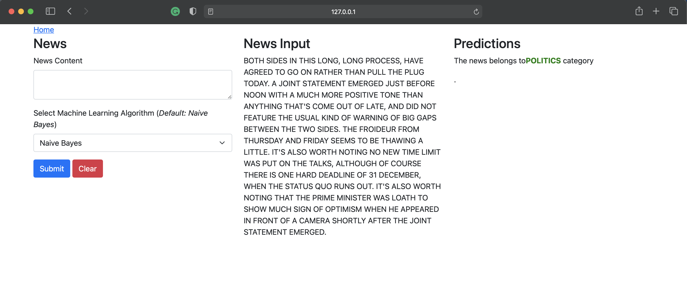

## Introduction

A web based machine learning news classifier tool. 

## Features

- Web based implementation, requires no knowledge of machine learning to run.
- 3 different machine learning algorithms - Naive Bayes, Random Forest and Logistic Regression

## Software requirements
* [Python](https://www.python.org) 3.X
* [Flask](https://flask.palletsprojects.com/en/1.1.x/) web framework.
* [scikit-learn](https://scikit-learn.org/stable/install.html) machine learning library.
* [Joblib](https://joblib.readthedocs.io/en/latest/) pipelining tool in python.

## Installation
`$ pip install package-name`

 - Example - Installation of joblib.
 
    `$ pip install joblib`
    
 **OR**
 
 `$ pip install -r requirements.txt` 
 
 
## Result

